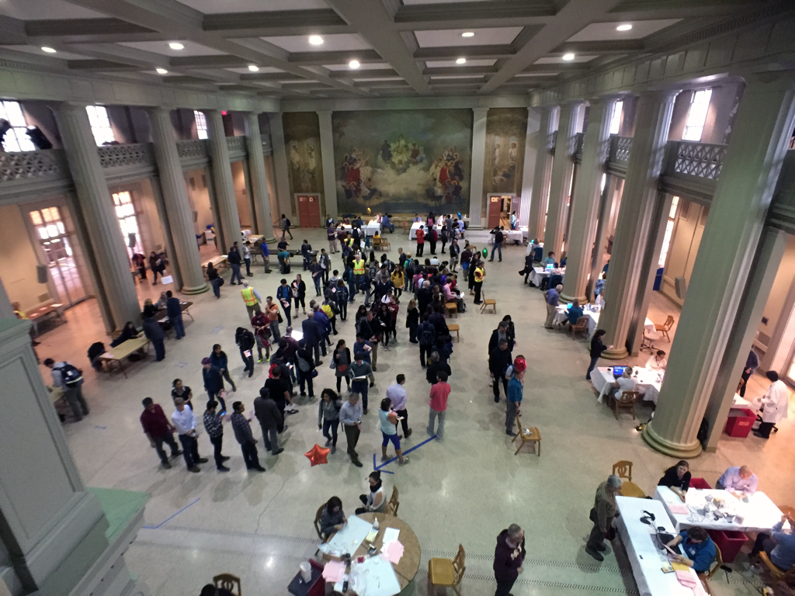

_Last updated: January 14, 2023_

This page will continue to be updated as we finalize more details. Please check back later for more information regarding events.

## Self Schedule

Self scheduling will open at **3 PM EST on January 9th, 2023** via our coach portal, ISOTOPE. Registration instructions with access code will be sent to coaches’ emails (whatever provided in the registration form) by the end of December 2022. If another coach on the team would like an additional account, please contact us at scioly@mit.edu.

## Flight

Flight will be held in the Morss Hall of Walker Memorial (Building 50). The ceiling height is approximately 28 ft and the room is approximately 91 ft by 52 ft for the area without the columns. See below for an image of the venue (the hall will be setup for the event on tournament day).

_Image from MIT Medical_

## Chemistry Lab, Forensics, Environmental Chemistry

For events requiring labs, we will not require competitors to bring lab equipment outlined in page 81 of the 2023 Division C Rules Manual. All necessary lab equipment will be provided for competitors except for PPE.

## Trial Events

For the 2023 MIT Invitational, we will be running three trial events:

-   Data Science ([Rules](docs/2023_data_science_rules.pdf))
-   Applied Game Theory ([Rules](docs/2023_applied_game_theory_rules.pdf))
-   Quantum Quandaries ([Rules](docs/2023_quantum_quandaries_rules.pdf))
