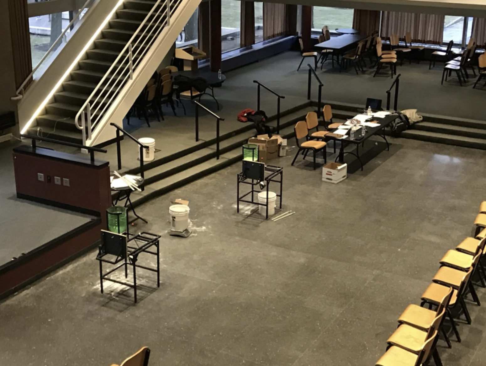
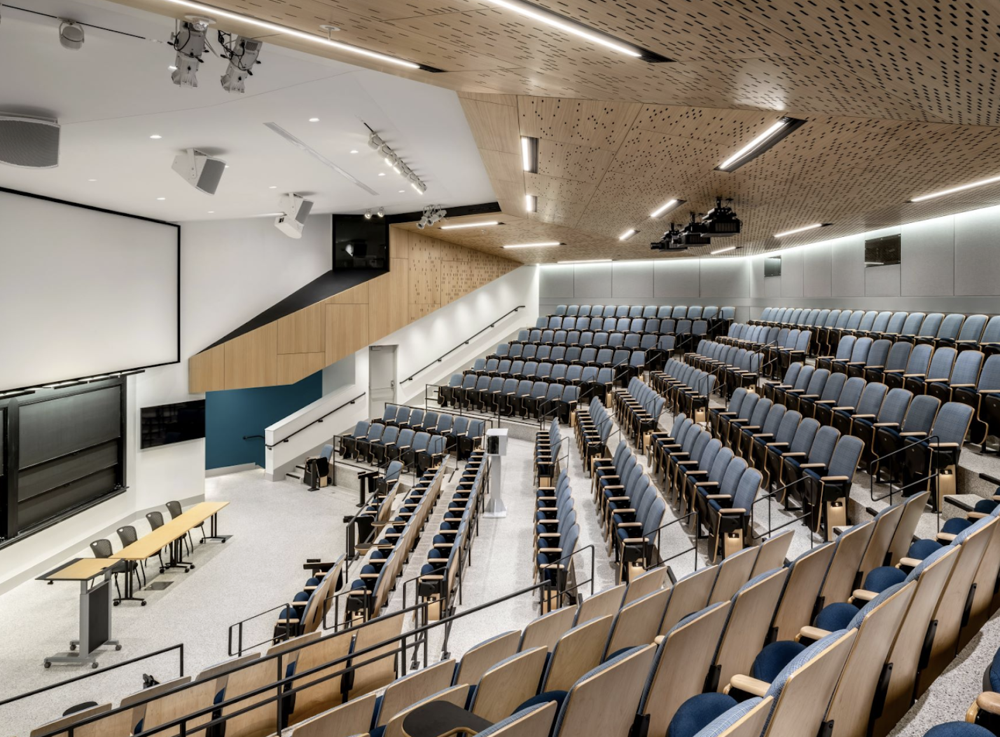

_Last updated: January 19, 2026_

## Event-Specific Information

As a reminder, MIT Invitationals will be following nationals rules with any rules clarified on [this page](https://www.soinc.org/events/rules-clarifications). A list of event supervisors can be found [here](https://scioly.mit.edu/event-supervisors).

Updates on other events may be added in the future.

### Astronomy

At least one competitor must bring a cell phone with internet connection and access to email for MIT wifi verification.

### Boomilever

For the 2026 Invitational, the Event Supervisors plan to use the same Test Apparatus (as defined in rule 6.) from prior years (see photo 1, which shows the setup for Boomilever) with modifications to the Test Base layout to meet current specifications (in rules 6.b.i-v.). Sand will be used for the free-flowing material (as specified in rule 7.f.). The event will be in a different room, 34-101 (see photo2), from prior years. All participants must bring their own type “B” eye protection. While the Event Supervisors will make every effort to run the event as planned, competitors should be prepared for any adjustments from prior years’ setup that may be necessary to allow the event to run; these may include but are not limited to changes to the Test Apparatus, changes to the free-flowing material, and changes to how sand is loaded.

{: width="45%" }
{: width="45%"}

### Chemistry Lab and Forensics

Competitors must bring the full laboratory kits specified in the Division C Chemistry Events Lab Equipment List, as well as required PPE. Students without PPE will not be permitted to enter the laboratory room.

### Electric Vehicle

Overall scores will be calculated using the Event Time Bonus, according to the Division C National Rules (5.f).

### Helicopter

The **updated** location of Helicopter is now 34-301 and 34-302. The ceiling height is approximately 10 ft.

{: width="75%"}

### Robot Tour

Overall scores will NOT be calculated using the Track Time Bonus from the Division C National Rules (5.g).

### Materials Science

Competitors must bring required PPE but do not need to bring the additional lab materials specified in the Division C Chemistry Events Lab Equipment List.

Competitors should also bring one laptop per team (should be a computer instead of a tablet/smart phone) capable of connecting to the Wi-Fi and running a modern browser such as Chrome, Firefox, etc. If teams cannot bring one, a laptop will be provided for the team by the event supervisors.

## Trial Events

For the 2026 Invitational, we will be running three trial events below. Trial events are self-scheduled through ISOTOPE, and alternates are allowed to compete in them.

| Event                  | Rules                                                                                                                                                                                                                                                                                                       |
| ---------------------- | ----------------------------------------------------------------------------------------------------------------------------------------------------------------------------------------------------------------------------------------------------------------------------------------------------------- |
| Lean Mean Meme Machine | [Link](https://drive.google.com/file/d/1Ctu0eB-zD1V7Sjon3-OzPMsV41SZW1yU/view?usp=sharing)                                                                                                                                                                                                                     |
| Scavenger Hunt         | [Link](https://drive.google.com/file/d/1RrhMT9dW0RJ9iafKWOJEN2sGqbUx4Ayb/view?usp=sharing)[Clarifications Blog Post](https://drive.google.com/file/d/1YTwh9dVlpuBY3ad8hmiTuFSpRYsKdb_N/view?usp=sharing) [Sample Test Post](https://drive.google.com/file/d/1iCTju5xQEGdCOkHHAzFvxJl7B7431pyD/view?usp=sharing) |
| Science Scramble       | [Link](https://drive.google.com/file/d/1Odzp4ugW5MAQYyJG9HDExcKkMSQXI7-n/view?usp=sharing)                                                                                                                                                                                                                     |

### Lean Mean Meme Machine

This year's pre-built meme should follow the suggested theme: "My Worst Fear Come True at MIT SciOly". Whether it be getting shocked at EV, lost on MIT campus, losing to your worst rivals, or your entomology partner asking you if you would still love them if they were a worm (you definitely wouldn't), we are enthusiastically waiting for your worst fears in the form of easily digestible .png's and .jpeg's. Submissions should be submitted through [this form](https://forms.gle/PU3EEW2NvAofMWP69) by 1/23/26 (end of day). They will be casually doomscrolled through and evaluated based on creativity (15%), relevance to the topic (20%), and humor (65%).
