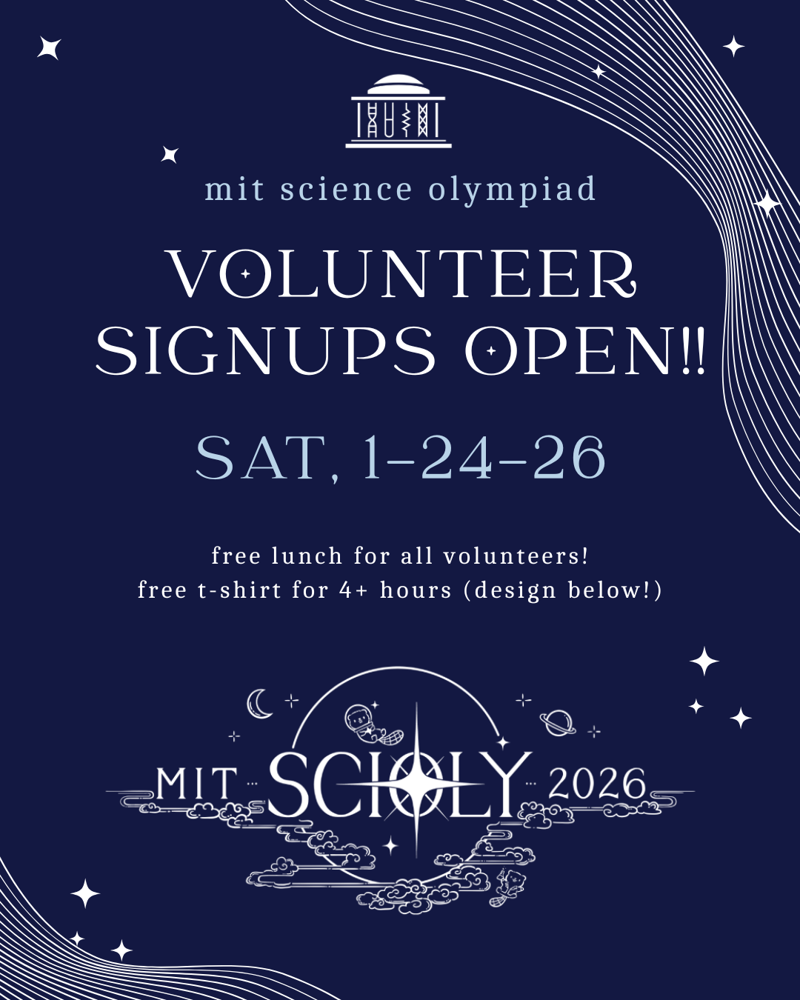

_Last updated: December 12, 2025_

We are looking for Boston-area students to volunteer for our 2026 Invitational on Saturday, January 24, 2026! Please note that high school students and coaches/parents of participating high schools are not eligible to volunteer.

No previous Science Olympiad experience is needed! We need volunteers for various tasks, and any help will be greatly appreciated. All volunteers will receive a **free meal**. If you volunteer for **at least 2 shifts (~4 hours)**, you will additionally receive a **free T-shirt** and if you volunteer for **at least 3 shifts (~6 hours)**, you will additionally receive a **free tote bag**!

If you would like to volunteer, you can **sign up [here](https://docs.google.com/forms/d/e/1FAIpQLSccX-LnP_cySB2isjSJHEOonqaokABq2vxzsHFb5wJLX3U90Q/viewform?usp=sharing&ouid=108891414546590554950)**! This volunteer sign-up form is **due Saturday, January 17, 2026 at 11:59 PM**. Note that this year's tournament is in-person. Feel free to email us at scioly@mit.edu with any questions or concerns.

{: width="50%" style="display: block; margin: 0 auto;"}
